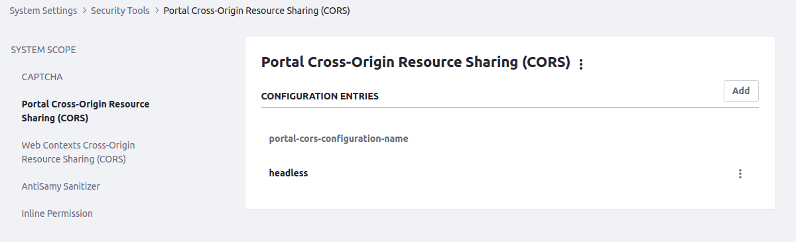
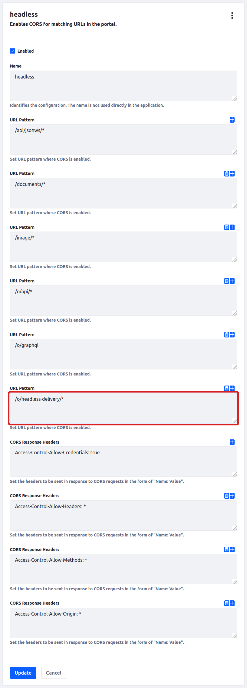
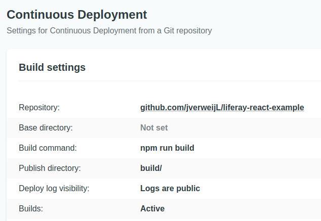

**This is for Liferay DXP 7.3!!!**

Liferay Resort Application using React JS and Liferay DXP

To get the application working you can do the following:
1. Create a `Service Account` role
1. Apply `View Permissions` for Web Content and Blogs for this role
1. Create a `Service Acount` user and give it the `Service Account` role
1. Import all the contents like banner, resort rooms, blogs from the repo ==> tree/master/Content%20LAR
1. Add `Portal Cross-Origin Resource Sharing (CORS)` entry  

1. Update the .env file to your Liferay DXP instance  
   1. REACT_APP_Authorization contains the base64 encoded username:password
   1. The username and password are combined with a single colon (:). This means that the username itself cannot contain a colon  
   1. The resulting string is encoded into an octet sequence. The character set to use for this encoding is by default unspecified, as long as it is compatible with US-ASCII, but the server may suggest use of UTF-8 by sending the charset parameter.
   1. The resulting string is encoded using a variant of Base64.
   1. PRO TIP: You can use postman or curl to see the encoded Authorization header
1. Push the updates to your github repo
1. You can use netlify.app with CI/CD capabilities to run the app online
1. Make sure to configure netlify with the following build instructions  

Done!

In case content or blogs are not showing checkout permissions. For blogs you might need a fix described here: https://issues.liferay.com/browse/PTR-1538